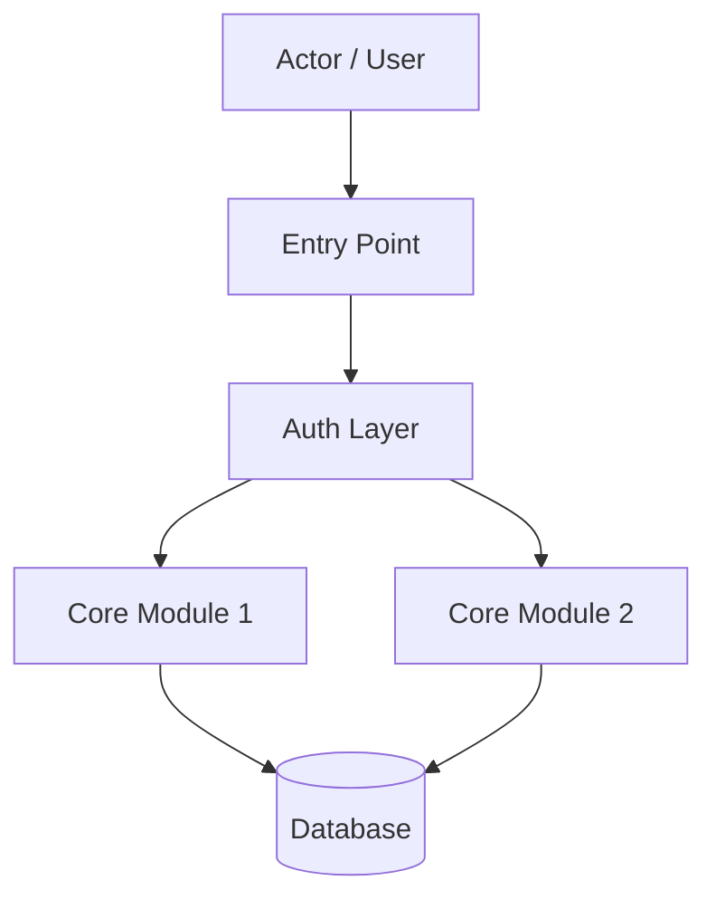
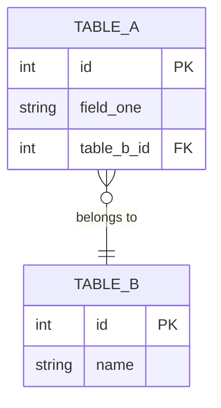

# [Project Name] — Roadmap

---

## Project Brief

A short paragraph describing what the project is, who it is for, and what problem it solves.
Keep this to 3–5 sentences. This is the first thing any reader sees.

---

## Rationale

Explain *why* this project exists. What gap does it fill? What alternatives were considered
and why were they rejected? Include any relevant background — organizational context,
stakeholder decisions, or prior attempts.

---

## Overview

Summarize the full scope of the project at a high level:

- What the system does
- What it deliberately does *not* do
- Who the primary users are
- What the expected outcome looks like when the project is complete

---

## Tech Stack

| Layer | Technology | Purpose |
|---|---|---|
| Language / Framework | e.g. Ruby on Rails | Core application |
| Database | e.g. PostgreSQL | Primary data store |
| Background Jobs | e.g. Sidekiq | Async processing |
| Authentication | e.g. bcrypt / JWT | Session and API auth |
| Authorization | e.g. Pundit | Role-based access |
| Frontend | e.g. Hotwire / Tailwind | UI layer |
| Containerization | e.g. Docker | Deployment packaging |
| Testing | e.g. RSpec | Automated test suite |

Add or remove rows as needed. Group by concern if the stack is large.

---

## System Flow Diagram

A high-level diagram showing how the major parts of the system connect.

Replace the nodes above with your actual system components.

---

## Entity-Relationship Diagram

Add all tables, columns, and relationships that reflect your actual schema.

---

## Roadmap — STRICTLY FOLLOW THE FORMATTING BELOW. DEVIATIONS ARE NOT ACCEPTABLE.

Every phase MUST follow this exact 3-level hierarchy: Phase > Days > Tasks.
- Minimum: 2 Days per Phase.
- Minimum: 3 Tasks per Day.
- Tasks must be atomic (implementable in under 15 minutes each).
- A single-task Day is invalid and must be expanded.
- Each Phase MUST end with a concrete, runnable Deliverable.

### Phase 0 — [Phase Name] (~N days, M tasks)

Brief description of what this phase accomplishes and why it comes first.

**Day 1**
- Task 1
- Task 2
- Task 3

**Day 2**
- Task 1
- Task 2
- Task 3

**Deliverable:** What is working and verifiable at the end of this phase.

---

### Phase 1 — [Phase Name] (~N days, M tasks)

Brief description.

**Day 1**
- Task 1
- Task 2
- ...

**Day 2**
- Task 1
- Task 2
- ...

...

**Deliverable:** What is working and verifiable at the end of this phase.

---

### Phase N — [Phase Name] (~N days) 

Continue the pattern above for each phase.

---

## Notes & Decisions Log

Use this section to record any decisions made mid-project that deviate from the original
plan, and the reason why.

| Date | Decision | Reason |
|---|---|---|
| YYYY-MM-DD | Changed X to Y | Because Z |